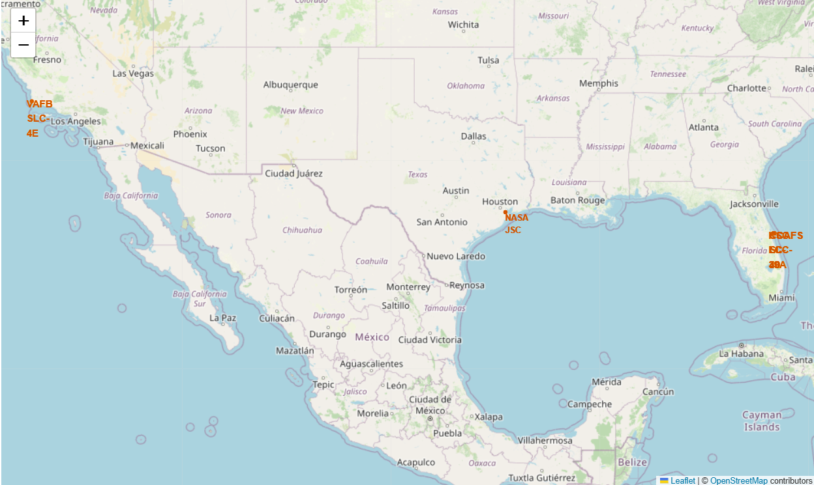
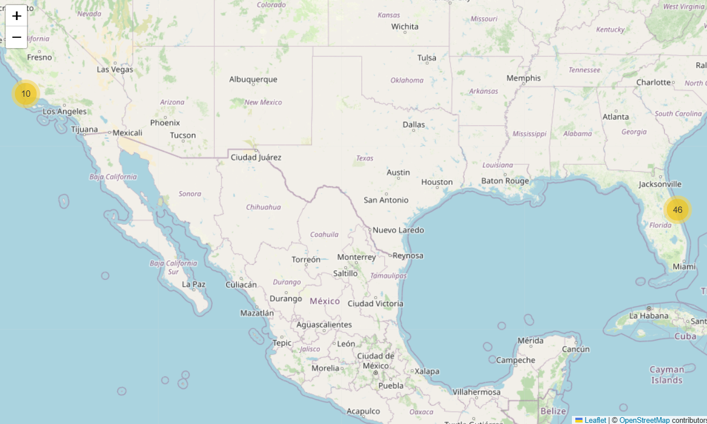
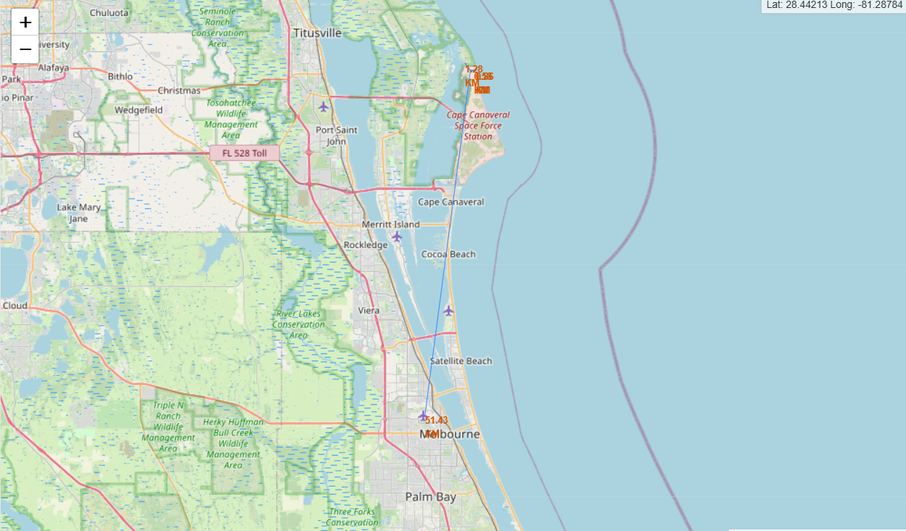
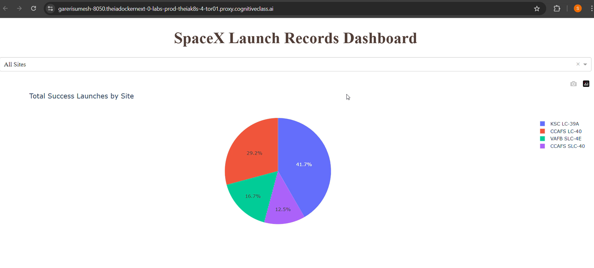

# 🚀 SpaceX Falcon 9 Landing Prediction

  

# IBM Data Science Capstone Project
# ⭐ Project Summary

This project predicts the successful landing of the SpaceX Falcon 9 first stage, which is essential because successful landings reduce launch costs from $62M to much lower values using reusable boosters.

Using real SpaceX launch data, the project applies:
✔ API data collection
✔ Web scraping
✔ Data wrangling & cleaning
✔ SQL queries
✔ Exploratory Data Analysis (EDA)
✔ Geospatial analysis with Folium
✔ Machine Learning modeling
✔ Interactive dashboard using Plotly Dash
✔ Final presentation (PPT)

This repository contains all notebooks, scripts, dataset, dashboard, maps, and presentation.

## 📁 Repository Contents
📦 ibm-spacex-falcon9-data-science-capstone-project
│
├── 1_spacex-data-collection.ipynb
├── 2_webscraping.ipynb
├── 3_spacex-Data wrangling.ipynb
├── 4_EDA-SQL.ipynb
├── 5_EDA-data-viz.ipynb
├── 6_launch_site_location.ipynb
├── 7_dash_app.py
├── 8_SpaceX_Machine Learning Prediction.ipynb
│
├── dataset.csv
│
├── Launch-site-proximity-on-map.png
├── Spacex-launch-record-dashboard.png
├── Spacex-launch-sites-on-map.png
├── Success-Failure-outcome-on-map.png
├── spacex-payload vs success.png
│
├── Final-Presentation-spacex-falcon9-data-science-capstone.pptx
│
├── LICENSE
└── README.md

🔍 Project Workflow
1️⃣ Data Collection (API)

Collected SpaceX Falcon 9 launch data using:

SpaceX API

JSON parsing

Automated data extraction

2️⃣ Web Scraping (Wikipedia)

Scraped additional launch details using:

BeautifulSoup

HTML table extraction

Data consistency checks

3️⃣ Data Wrangling

Cleaned and merged datasets

Converted categorical values

Engineered landing success labels

Removed missing values & duplicates

4️⃣ SQL-Based EDA

Performed analytical queries:

Launch success by year

Booster version analysis

Orbit success rate

Payload mass comparisons

5️⃣ Python EDA

Generated visual insights:

Payload vs landing success

Booster category performance

Launch site comparison

Outcome distributions

6️⃣ Launch Site Mapping (Folium)

Created interactive maps:

Launch site coordinates

Success & failure markers

Proximity to coastline, railways, highways

🤖 Machine Learning Modeling

Models trained:

Logistic Regression

K-Nearest Neighbors

Support Vector Machine

Decision Tree Classifier

Best Model: Decision Tree

High accuracy

Interpretable

Works well with engineered features

📊 Dashboard (Plotly Dash)

The interactive dashboard (from 7_dash_app.py) allows users to:

Select launch sites

Adjust payload mass range

View interactive scatter plots

Inspect launch success charts

📂 Dataset

File: dataset.csv
Includes the following columns:

FlightNumber

PayloadMass

Orbit

LaunchSite

BoosterVersion

Outcome

LandingSuccess (target)

🖼 Project Visuals
Launch Sites

Success & Failure Outcomes

Launch Site Proximity

Dashboard launch Records

  

Payload–Success Relationship

## 🎤 Final Presentation (PPT)
📌 The project presentation is included:
Final-Presentation-spacex-falcon9-data-science-capstone.pptx

It summarizes:

Objective

Approach

Analysis

Results

Machine learning performance

Conclusion

▶️ Running the Project
Run notebooks
jupyter notebook

Run the Dash app
python 7_dash_app.py

📜 License

This project is licensed under the MIT License.

## 👤 Author

## Sumesh
## GitHub: https://github.com/Sumesh0015
